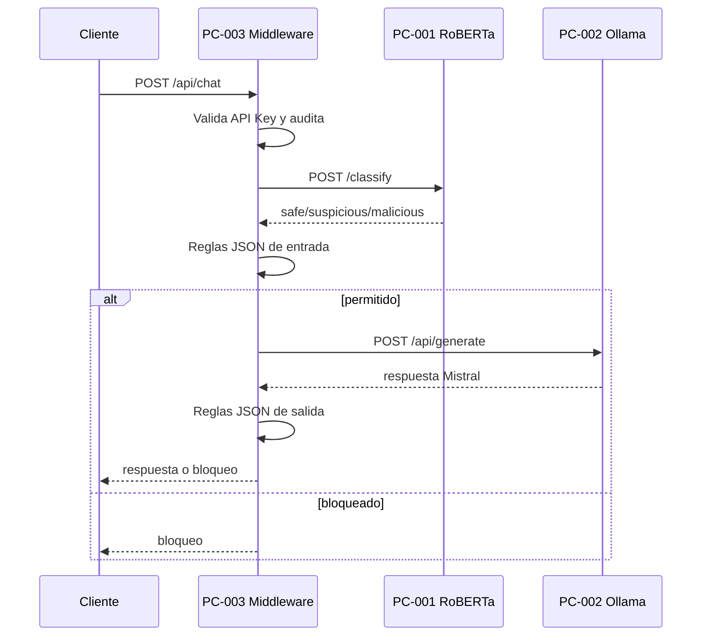
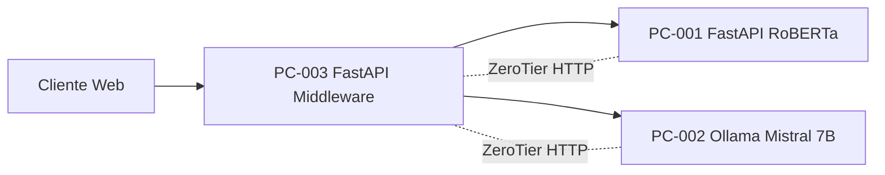

# SCADA LLM Security Middleware

Sistema académico orientado a producción para proteger solicitudes y respuestas de modelos de lenguaje en el dominio SCADA y redes eléctricas.

## Árbol del Proyecto

```text
project/
├── app/
│   ├── api/
│   ├── core/
│   ├── middleware/
│   ├── models/
│   ├── rules/
│   ├── schemas/
│   ├── security/
│   ├── services/
│   ├── utils/
│   └── logs/
├── models/
├── tests/
├── .env
├── main.py
├── pytest.ini
└── requirements.txt
```

## Modos de Ejecución

PC-001, clasificador RoBERTa:

```powershell
$env:SERVICE_ROLE="classifier"
uvicorn main:app --host 0.0.0.0 --port 8001
```

PC-003, middleware principal:

```powershell
$env:SERVICE_ROLE="middleware"
uvicorn main:app --host 0.0.0.0 --port 8000
```

Desarrollo con hot reload:

```powershell
.\dev.ps1
```

PC-002 usa Ollama nativo:

```powershell
ollama serve
ollama pull mistral:7b-instruct-v0.3-q8_0
```

## Variables `.env`

```env
SERVICE_ROLE=middleware
ROBERTA_MODEL_PATH=./models/roberta_scada
ROBERTA_URL=http://10.147.0.10:8001
OLLAMA_URL=http://10.147.0.20:11434
OLLAMA_MODEL=mistral:7b-instruct-v0.3-q8_0
API_KEY=super_secret_key
```

## Endpoints

`GET /health`

```json
{
  "status": "healthy",
  "roberta_loaded": true,
  "ollama_available": true
}
```

`POST /classify`, solo en `SERVICE_ROLE=classifier`.

```json
{
  "text": "Explain Modbus at a high level."
}
```

`POST /api/chat`, solo en `SERVICE_ROLE=middleware`.

```powershell
Invoke-RestMethod `
  -Method POST `
  -Uri http://localhost:8000/api/chat `
  -Headers @{ "X-API-Key" = "super_secret_key" } `
  -ContentType "application/json" `
  -Body '{"prompt":"Explain what IEC 61850 is at a high level."}'
```

Cliente web:

```text
http://localhost:8000/
```

Respuesta permitida:

```json
{
  "request_id": "uuid",
  "decision": "allowed",
  "classification": {
    "label": "safe",
    "score": 0.94
  },
  "triggered_rules": [],
  "response": "..."
}
```

Respuesta bloqueada:

```json
{
  "request_id": "uuid",
  "decision": "blocked_input",
  "classification": {
    "label": "malicious",
    "score": 0.98
  },
  "triggered_rules": ["protocol-dnp3-control"],
  "response": "Solicitud bloqueada por políticas de seguridad SCADA."
}
```

Servicio degradado RoBERTa:

```json
{
  "status": "error",
  "service": "roberta",
  "message": "RoBERTa model not loaded"
}
```

Servicio degradado Ollama:

```json
{
  "status": "error",
  "service": "ollama",
  "message": "Ollama service unavailable"
}
```

## Diagramas Mermaid

Flujo principal:



Despliegue:



## Módulos

`app/api`: routers de salud, clasificación y chat.

`app/core`: configuración, logging JSON, fábrica FastAPI y excepciones.

`app/security`: validación de `X-API-Key`.

`app/services`: clientes HTTP, clasificador RoBERTa, motor de reglas y auditoría JSONL.

`app/rules`: reglas separadas por protocolos, subestaciones, centros de control, entrada, salida y patrones maliciosos.

`app/schemas`: contratos Pydantic v2.

`app/middleware`: manejo centralizado de errores.

## Pruebas

```powershell
pytest
```

Las pruebas cubren bloqueo por reglas, comportamiento degradado del clasificador y validación de API Key.
