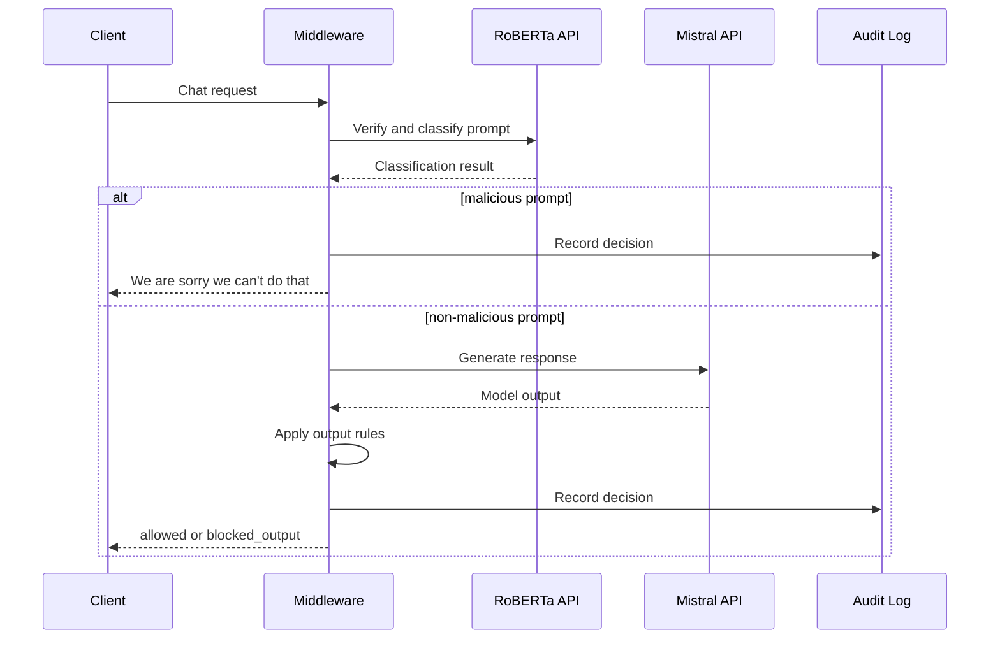

# Architecture

## Table of Contents

1. [Overview](#1-overview)
2. [Runtime Role](#2-runtime-role)
3. [System Context](#3-system-context)
4. [Main Components](#4-main-components)
5. [Request Flow](#5-request-flow)
6. [Configuration](#6-configuration)
7. [Error Handling](#7-error-handling)
8. [Audit Trail](#8-audit-trail)
9. [Operational Boundary](#9-operational-boundary)

## 1. Overview

This project is a FastAPI middleware for protecting LLM requests and responses in a SCADA and electrical-grid context.

It runs as the main security gateway inside a private `10.x.x.x` network. The middleware receives web/API requests, sends each prompt to an internal RoBERTa classifier API first, rejects malicious prompts, forwards only non-malicious prompts to an internal Mistral API, and records audit events.

## 2. Runtime Role

This repository is intended to run as middleware only.

Responsibilities:

- Serve the web chat client.
- Receive internal chat requests.
- Send every prompt to the internal RoBERTa classifier API before calling Mistral.
- Reject malicious prompts with `We are sorry we can't do that`.
- Call the internal Mistral API only for prompts classified as non-malicious.
- Apply output rules to the Mistral response.
- Write audit logs.

## 3. System Context

```text
Client / Web UI
      |
      v
SCADA LLM Security Middleware
      |
      |-- RoBERTa client  --> Internal RoBERTa service
      |
      |-- Mistral client  --> Internal Mistral service
      |
      |-- Rule engine     --> Local JSON rules
      |
      '-- Audit service   --> Local JSONL audit log
```

Endpoint details and external service contracts are documented in [API.md](API.md).

## 4. Main Components

```text
app/
├── api/             HTTP routes and dependencies
├── core/            settings, app factory, logging, exceptions
├── middleware/      centralized error handling
├── rules/           JSON rule definitions
├── schemas/         Pydantic request/response contracts
├── security/        security-related helpers
├── services/        RoBERTa, Mistral, rules, audit services
├── utils/           shared utilities
└── web/             browser chat client
```

## 5. Request Flow



## 6. Configuration

Runtime configuration is loaded from `.env` through `app/core/config.py`.

Configuration controls the internal service locations, timeout behavior, rule location, and audit log location. See [API.md](API.md) and `.env.example` for request-level details.

Use `.env.example` as the public template. Do not commit `.env`.

## 7. Error Handling

Service failures are converted into structured responses by the centralized error handler.

Expected degraded cases:

- RoBERTa API unavailable.
- Mistral API unavailable.
- Backend request timeout.

The web client displays a user-facing unavailable message when the backend cannot respond within the configured timeout.

## 8. Audit Trail

The audit service records decisions to JSONL.

Audit events include:

- Request ID.
- Client host.
- Prompt.
- Classification label and score.
- Triggered rules.
- Final decision.
- Timing metrics.
- Generated response.

Review audit logs before sharing them because they can contain prompts and model outputs.

## 9. Operational Boundary

The middleware does not own or host the RoBERTa or Mistral services. It depends on those internal services being available on the private network.
